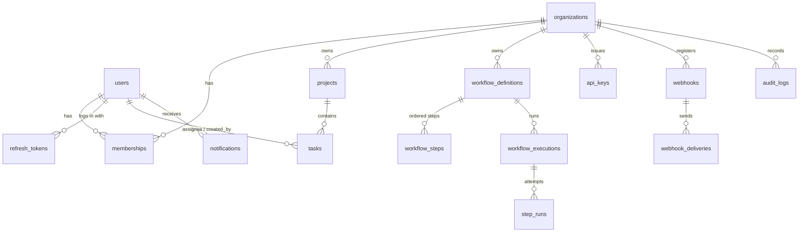

# Data model

## Constraints and indexes that matter
| Where | What | Why |
|---|---|---|
| `users.email` | `CITEXT UNIQUE` | case-insensitive uniqueness without `lower()` everywhere |
| `memberships` | PK `(user_id, org_id)` | one role per user per org |
| `tasks` | `CHECK priority BETWEEN 1 AND 5`, `version int` | DB backs up domain rules; optimistic locking |
| `tasks` | `(project_id, created_at, id)` | keyset pagination is an index range scan |
| `tasks` | `(project_id, status)`, `(assignee_id, status)` | common filters |
| `tasks` | partial `(due_at) WHERE status <> 'done'` | "overdue" queries skip finished tasks |
| `projects` | partial `(org_id) WHERE archived_at IS NULL` | active project lists |
| `workflow_steps` | `UNIQUE (definition_id, position)` | step order is unambiguous |
| `workflow_executions` | partial `(status) WHERE status IN ('pending','running')` | recovery scans stay small |
| `step_runs` | partial `UNIQUE (execution_id, position) WHERE status='succeeded'` | a step can succeed at most once: idempotency enforced by the DB |
| `api_keys.prefix` | `UNIQUE` | O(1) key lookup; secret stored only as SHA-256 |
| `notifications` | partial `(user_id, created_at) WHERE read_at IS NULL` | unread badge queries |
| `audit_logs` | `(org_id, created_at)`, `(entity_type, entity_id)` | org timeline, per-entity history |

Migrations: `alembic/versions/0001…0005`, each with a tested `downgrade()` (the test suite runs
`downgrade base` then `upgrade head` on every run).
